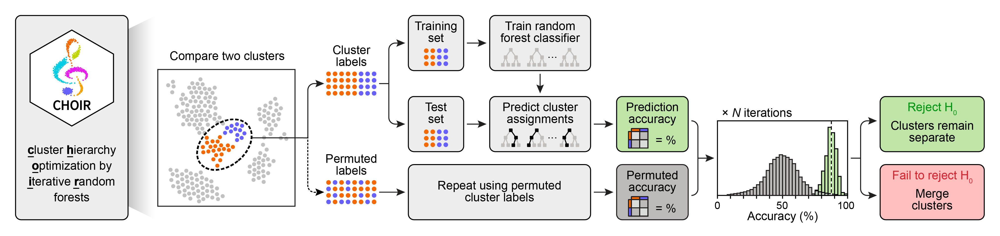
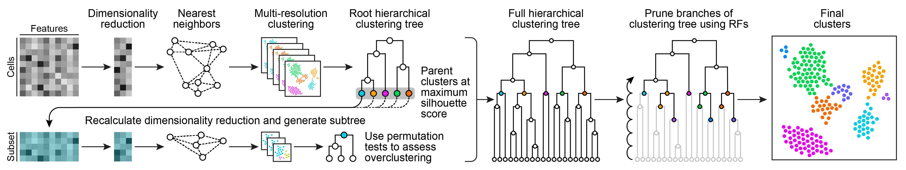

<br>
<a href ="https://www.CHOIRclustering.com"></a>

<!-- badges: start -->
<!-- badges: end -->

**CHOIR** (**c**luster **h**ierachy **o**ptimization by **i**terative **r**andom forests) is a clustering algorithm for single-cell data. CHOIR applies a framework of permutation tests and random forest classifiers across a hierarchical clustering tree to statistically identify clusters that represent distinct populations.

<br>

## Citation

CHOIR is on bioRxiv! You can find it [here](https://www.biorxiv.org/content/10.1101/2024.01.18.576317v1).

Sant et al., CHOIR improves significance-based detection of cell types and states from single-cell data. *bioRxiv* (2024)

## Installation

CHOIR is designed to be run on Unix-based operating systems such as macOS and linux.

CHOIR installation currently requires `remotes` and `BiocManager` for installation of GitHub and Bioconductor packages. Run the following commands to install the various dependencies used by CHOIR:

First, install remotes (for installing GitHub packages) if it isn’t already installed:
```
if (!requireNamespace("remotes", quietly = TRUE)) install.packages("remotes")
```

Then, install BiocManager (for installing bioconductor packages) if it isn’t already installed:
```
if (!requireNamespace("BiocManager", quietly = TRUE)) install.packages("BiocManager")
```

Then, install CHOIR:
```
remotes::install_github("corceslab/CHOIR", ref="main", repos = BiocManager::repositories(), upgrade = "never")
```

Notes:

* Installation should complete in under 2 minutes.
* This package is supported for macOS and Linux. 
* CHOIR depends heavily on the Seurat package, which has been undergoing many changes in recent months. It has been tested successfully with Seurat version 4.3.0 and 5.0.1.
* Other package dependencies can be found in the "DESCRIPTION" file.

## Usage

Please follow the [vignette](https://www.choirclustering.com/articles/CHOIR.html). The vignette takes less than 10 minutes to run on a standard laptop.

## How CHOIR works

CHOIR is a hierarchical clustering algorithm that uses permutation testing for cluster
identification by statistical inference. 

<p align="left"></a></p>

CHOIR identifies clusters that should be merged by applying a permutation test approach to assess the accuracy of random forest classifiers in predicting cluster assignments from a normalized feature matrix.

<p align="left"></a></p>

CHOIR constructs and iteratively prunes a hierarchical clustering tree using statistical inference to prevent underclustering and overclustering.

<hr>

<p align="left"><a href ="https://www.corceslab.com/"></a></p>

CHOIR is developed and maintained by the [Corces Lab](https://www.corceslab.com/) at the Gladstone Institutes.
