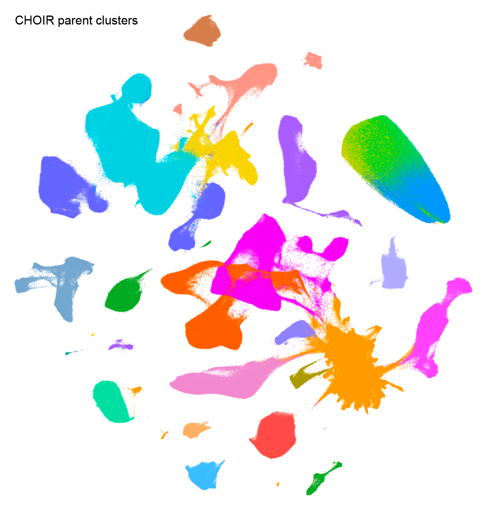
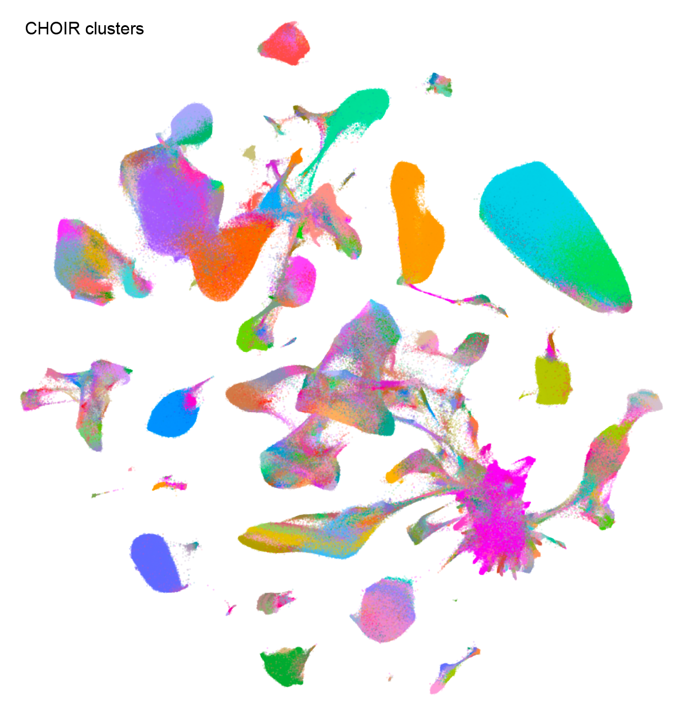
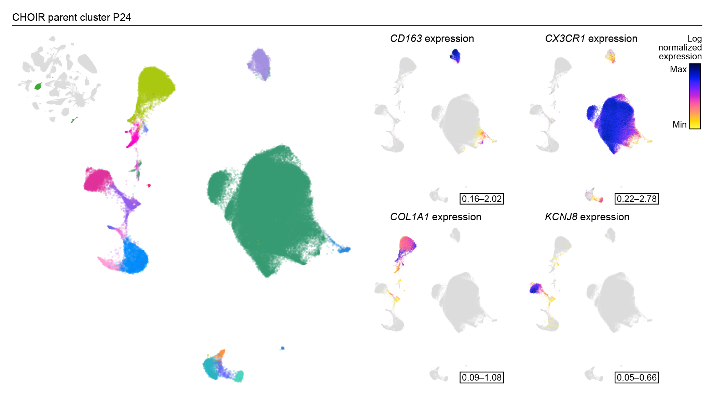

```{r, include = FALSE}
knitr::opts_chunk$set(
  collapse = TRUE,
  comment = "#>"
)
```

# Introduction

This vignette provides a basic example of how to run CHOIR on atlas-scale data. Throughout this vignette, sample results will be shown that use human brain atlas data from Siletti et al. 2023 (https://doi.org/10.1126/science.add7046), consisting of ~3.3M cells.

Using CHOIR “straight out of the box” works best on datasets with under 500,000 cells. While some larger datasets up to 1 million cells may also run smoothly, other datasets of this size or larger may encounter computational limits. In general, our assumption as developers is that end-users who are attempting to analyze datasets larger than 500,000 cells have access to high-performance computational resources that enable parallelization. At this scale of dataset, annotation of cell groups can often take weeks of manual effort without the assistance of a tool like CHOIR. While CHOIR will likely require at least 24 hours to run on a dataset of 500,000 cells, it will store all of the information an end-user would need to both annotate clusters and check the decisions made by CHOIR. Specifically, for each cluster, including those that were merged along the way, CHOIR stores the features found to be most important for the cluster (e.g., marker genes) and the reasoning behind why CHOIR merged or did not merge that cluster. These records can be found in `CHOIR → records → feature_importance_records` and `CHOIR → records → comparison_records`.

To use CHOIR on atlas-scale data, we recommend a three-step approach that partitions the dataset into smaller relevant chunks (step 1), runs CHOIR in parallel on those smaller chunks (step 2), and then stitches the results back together to provide a final set of clusters (step 3).

You’ll need the following packages:
```{r, eval = FALSE}
library(CHOIR)
library(Seurat)
```

# Step 1: Generate parent clusters

On the full dataset, run the CHOIR function `buildParentTree`. This function runs the initial dimensionality reduction, optional batch correction, and subsequent steps to generate the “parent” clustering tree. This clustering tree extends from a single cluster encompassing all cells to the cluster level at which the silhouette score is maximized.

```{r, eval = FALSE}
object <- buildParentTree(object)
```

# Step 2: Subset each parent cluster

Subset each parent cluster and save it as a separate object.

```{r, eval = FALSE}
# For example
subtree_s <- subset(obj, subset = CHOIR_parent_clusters == "P1")
```

If any of these resulting “parent clusters” are above 450,000 cells, a minimal number of further subdivisions are run on that parent cluster until the resulting subclusters are all under 450,000 cells.

```{r, eval = FALSE}
if (ncol(subtree_s) > 450000) {
  # Get nearest neighbors
  subtree_s <- subtree_s %>% 
    FindVariableFeatures() %>%
    ScaleData() %>% 
    RunPCA() %>% 
    FindNeighbors()
  # Find starting resolution
  starting_resolution <- CHOIR:::.getStartingResolution(subtree_s@graphs$RNA_snn,
                                                        cluster_params = list(algorithm = 1,
                                                                              group.singletons = TRUE),
                                                        random_seed = 1,
                                                        verbose = TRUE)
  # Get clusters at starting resolution
  subtree_s <- FindClusters(subtree_s, resolution = starting_resolution[["starting_resolution"]])
  # Further subset each resulting cluster
  subtree_s_0 <- subset(subtree_s, subset = seurat_clusters == 0)
  subtree_s_1 <- subset(subtree_s, subset = seurat_clusters == 1)
  # Etc..
}
```

For example, 25 parent clusters resulted from the Siletti et al. 2023 human brain atlas data. Three of those were above 450,000 cells, and were split further prior to step 3.

<p align="left"></a></p>

# Step 3: Run CHOIR on each subsetted parent cluster

For *each* subsetted object:

First, run the standard CHOIR method, but retain the parameter settings used in `buildParentTree`, including the `downsampling_rate`. This can be done most efficiently using parallel jobs submitted to an HPC, one per subsetted object.

```{r, eval = FALSE}
subtree_s <- CHOIR(subtree_s,
                   key = "CHOIR_subtree",
                   downsampling_rate = object@misc$CHOIR$parameters$buildParentTree_parameters$downsampling_rate)
```

If any parent clusters cannot be subclustered further, instead run the following code:

```{r, eval = FALSE}
# Add cluster labels for a single cluster
subtree_x@misc$CHOIR_subtree$clusters <- data.frame(CellID = colnames(subtree_x),
                                            CHOIR_clusters_0.05 = 1,
                                            Record_cluster_label = "P0_L0_1")

# Add parameter records matching remaining subtrees
subtree_x@misc$CHOIR_subtree$parameters <- subtree_s@misc$CHOIR$parameters
```

For example, parent cluster P9 from the Siletti et al. 2023 human brain atlas data was composed of 1395 cells from a single batch, and did not require further subclustering.

Then, extract the resulting clusters, clustering trees, and comparison records using the CHOIR function `getRecords`.

```{r, eval = FALSE}
subtree_records_list <- vector(mode = "list", length = n_subtrees)
for (s in 1:n_subtrees) {
  subtree_records_list[[s]] <- getRecords(subtree_objects_list[[s]], key = "CHOIR_subtree")
}
```

# Step 4: Combine subtrees and standardize significance thresholds

Run the CHOIR function `combineTrees` on the complete set of records extracted in step 2. In doing so, the significance threshold will be standardized across all clustering trees, yielding a final set of clusters.

```{r, eval = FALSE}
object <- combineTrees(object,
                       subtree_list = subtree_records_list)
```

# Plot

After clustering has finished, we can generate a UMAP dimensionality reduction and use function `plotCHOIR` to plot a visualization of the clusters.

```{r, eval = FALSE}
# Run UMAP
object <- runCHOIRumap(object,
                       reduction = "P0_reduction")
# Plot
plotCHOIR(object)
```

Here is an example using human brain atlas data from Siletti et al. 2023.

<p align="left"></a></p>

For more granularity, subsets of clusters can be visualized using each subtree dimensionality reduction.

```{r, eval = FALSE}
# Run UMAP
object <- runCHOIRumap(object,
                       reduction = "P24_reduction")
# Plot
plotCHOIR(object, reduction = "P24_reduction_UMAP")
```

This example shows parent cluster P24 from the human brain atlas data from Siletti et al. 2023, which includes clusters corresponding to macrophages, microglia, fibroblasts, and pericytes, among other cell types.

<p align="left"></a></p>

